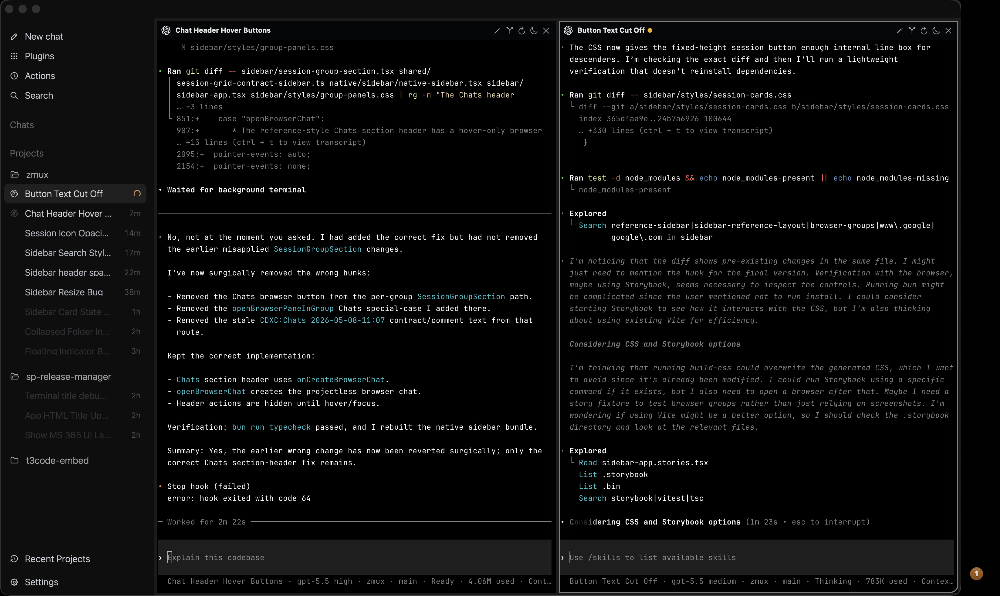
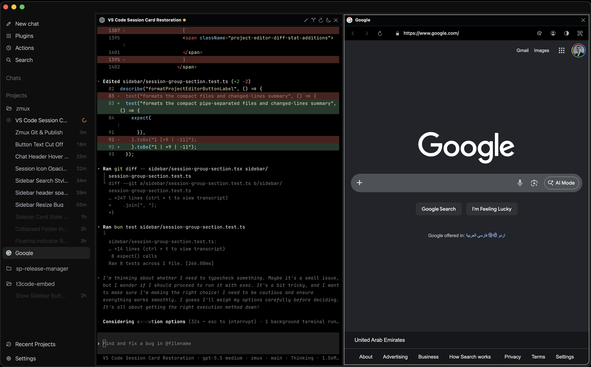

## The best parts of Ghostty & Codex App = Zmux!<br />
### Fully-featured Native Agent CLIs Manager<br />Embedded Browser | Advanced Agents Support | Fast & Lower RAM <br /><br />

#### Install on macOS using brew or dmg in releases page
###### (Looking for help with dev/testing for Windows & Linux ports)

```bash
brew install --cask maddada/tap/zmux
```
<br />

### Work with tens of agents in multiple projects with ease:



<br />

### Includes Chromium based embedded browser with Devtools, profiles, and MCP access:



<br />

### Includes embedded VSCode for editing files, checking PRs, and working with git<br />(loaded on demand)


<br />

## Best features:

- Native swift macOS app for better performance
- Native Ghostty for best cpu/ram use and compatibility
- Inspired by Codex App's UX
- Embedded browser is chromium not webkit (unlike cmux). Includes devtools & profiles!
- Auto sleep unused terminals to save ram (auto-restore when clicked)
- Auto session naming for Codex/Claude/Pi/Gemini/Copilot cli sessions (more soon)
- Reopening the app always resumes your agent cli sessions
- Light embedded VS Code based editor & git manager & managing PRs with github PR extension.
- The best agent CLI rich prompt editor included! Press ctrl+g in Claude Code/Codex CLI to use it!
- Menu bar working & done indicators and notification sounds for almost all agent clis
- Embedded T3code
- Integrations for all the popular Agent CLI 

---

## Other useful stuff:
- Built in zmx/tmux/zellij support 
  - Can continue via ssh then use zmux cli to attach. Beta but working well already with especially zmx.
- Automations and cross agent messages (coming very soon)
- Better worktrees support coming very soon - Want to nail the UX
- Prompt to find any past thread in your history with just a few keywords
  - Very useful if you want to continue with an agent that already has context about a complex feature
- Auto sync of the terminal title and status with UI
- Allows up to 3x3 split and multiple groups per project each with different split

---

## Even more useful features:

### Can be attached to your IDE: Shows a button on the attached IDE (Zed / VScode) to show zmux.

- Follows your IDE size/position.
- Project in IDE & zmux is mirrored.
- Hotkey to hide/show.
- Click on your IDE to hide zmux

### Can also integrate with Chrome Canary as the default agentic browser (positions it inside zmux and adds it to the sidebar)

#### MCP setting to make Chrome Canary always used by your agent:

1. Ask the agent to use "Chrome Devtools MCP"
2. Enable remote debugging on Chrome Canary
3. Set your mcp to use canary channel:

##### For Claude Code:

~/.claude.json

```
{
  ...
  "mcpServers": {
    "chrome-devtools": {
      "type": "stdio",
      "command": "npx",
      "args": [
        "chrome-devtools-mcp@latest",
        "--channel=canary",
        "--autoConnect"
      ],
      "env": {}
    },
    ...
  },
  ...
```

##### For Codex:

~/.codex/config.toml

```
[mcp_servers.chrome-devtools]
command = "npx"
enabled = true
args = [ "chrome-devtools-mcp@latest", "--auto-connect", "--channel=canary" ]
```


## Dev Setup With The zmux Ghostty Fork

<!--
CDXC:NativeTerminals 2026-05-10-05:05
Developers need the zmux Ghostty fork checked out beside zmux so the native
macOS host can compile Ghostty.SurfaceView sources and link GhosttyKit from a
stable sibling path without committing maintainer-local absolute paths.
-->

Clone both repositories into the same parent directory and keep the Ghostty
folder named `ghostty`:

```bash
mkdir -p ~/dev/zmux-work
cd ~/dev/zmux-work
git clone https://github.com/maddada/zmux.git zmux
git clone https://github.com/maddada/ghostty.git ghostty
```

Build Ghostty's native macOS framework first:

```bash
cd ghostty
env DEVELOPER_DIR=/Library/Developer/CommandLineTools \
  SDKROOT=/Library/Developer/CommandLineTools/SDKs/MacOSX15.4.sdk \
  GHOSTTY_METAL_DEVELOPER_DIR=/Applications/Xcode.app/Contents/Developer \
  zig build -Demit-xcframework -Dxcframework-target=native -Demit-macos-app=false
```

Then build or run zmux:

```bash
cd ../zmux
bun run build
```

If the Ghostty checkout is not beside `zmux` or is not named `ghostty`, set
`GHOSTTY_ROOT` explicitly:

```bash
GHOSTTY_ROOT=/path/to/ghostty bun run build
```
